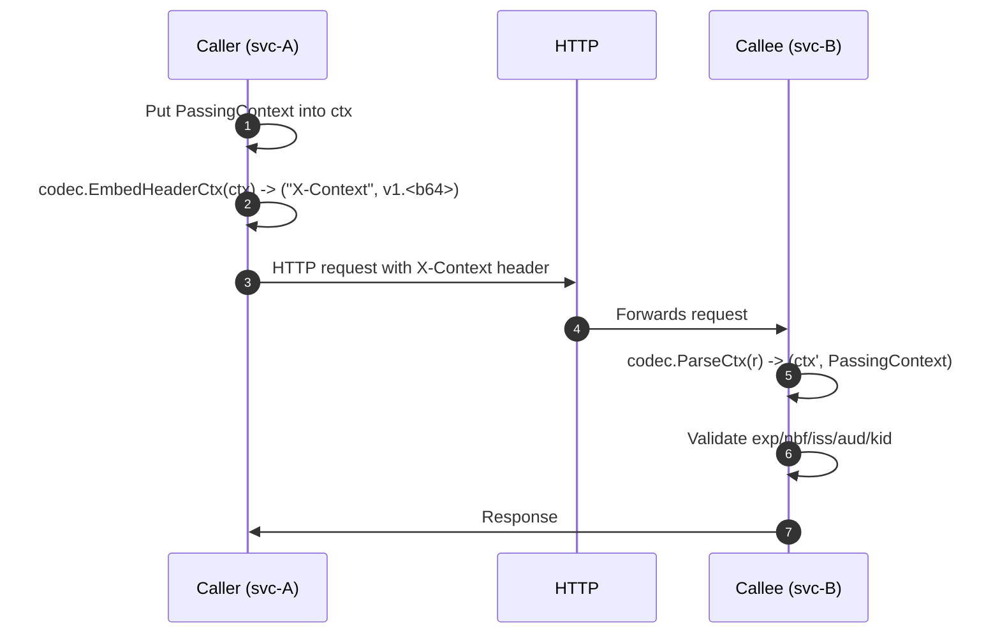

# xctx - Cross Context

**Typed, encrypted context propagation over a single HTTP header.**

`xctx` lets Go services pass a **strongly-typed struct** (e.g. user/session/tenant info) from one service to another via a single header (default: `X-Context`). The payload is **encrypted and integrity‑protected** using **AES‑256‑GCM** (stdlib only), and the library is **schema‑agnostic**: it never needs to know your struct layout.

> Why? No more scattering values across headers/query/body, no more plain‑text context. One header in, one typed struct out.

---

## Features

* **Typed by design** – you define a struct; no `map[string]any`.
* **Opaque single header** – compact, versioned, encrypted blob (`v1.…`).
* **Stdlib crypto** – AES‑256‑GCM; no external dependencies.
* **Key rotation** – via `kid` (key ID); accept old keys during rollouts.
* **TTL & claims** – `iat/nbf/exp/jti`, optional `iss/aud` checks.
* **Optional AAD binding** – couple the token to ambient data to resist replay across channels.
* **Tiny surface** – a few primitives: `Keyring`, `Codec[T]`, `EmbedHeaderCtx`, `ParseCtx`.

---

## Install

```bash
go get <your-module-path>/xctx
```

> Replace `<your-module-path>` with your repo/module path (e.g. `github.com/acme/xctx`).

---

## Quick Start

### 1) Define your typed payload

```go
// PassingContext is what you want to propagate.
type PassingContext struct {
    UserID   int32  `json:"uid"`
    UserName string `json:"un"`
    Role     string `json:"role,omitempty"`
}
```

### 2) Set up a typed key and a codec

```go
import "github.com/ArieDeha/xctx"

var typedKey = xctx.NewTypedKey[PassingContext]("xctx")

func newCodec() *xctx.Codec[PassingContext] {
    // 32‑byte AES keys; load from a secure store in real deployments.
    currentKID := "kid-2025-10"
    currentKey := []byte("0123456789abcdef0123456789abcdef") // example

    kr, _ := xctx.NewKeyring(currentKID, currentKey, nil)

    return xctx.NewCodec[PassingContext](kr,
        xctx.WithHeaderName[PassingContext]("X-Context"),
        xctx.WithIssuer[PassingContext]("svc-A"),    // optional
        xctx.WithAudience[PassingContext]("svc-B"),  // optional
        xctx.WithExtractor(xctx.DefaultExtractor[PassingContext](typedKey)),
        xctx.WithInjector(xctx.DefaultInjector[PassingContext](typedKey)),
    )
}
```

### 3) Caller: embed the header

```go
func callOtherService(ctx context.Context, url string) error {
    codec := newCodec()

    // Put your struct into ctx at any point earlier in the pipeline.
    ctx = xctx.DefaultInjector[PassingContext](typedKey)(ctx, PassingContext{
        UserID: 42, UserName: "arie", Role: "admin",
    })

    req, _ := http.NewRequestWithContext(ctx, http.MethodGet, url, nil)

    // One line to set the header
    if err := codec.SetHeader(req, ctx); err != nil { return err }

    // … send request
    return nil
}
```

### 4) Callee: parse and inject

```go
func handler(w http.ResponseWriter, r *http.Request) {
    codec := newCodec()

    ctx, pc, err := codec.ParseCtx(r)
    if err != nil {
        http.Error(w, "invalid X-Context", http.StatusUnauthorized)
        return
    }

    // pc is your typed PassingContext
    fmt.Fprintf(w, "Hello %s (id=%d)", pc.UserName, pc.UserID)

    // … and it’s also in ctx under typedKey if you used the default injector
    _ = ctx
}
```

---

## Flow (sequence)



---

## API

### Types

* `type Keyring struct` – holds symmetric AES keys by KID.
* `type TypedKey[T any] struct` – unique context key helper for type `T`.
* `type Extractor[T any] func(ctx context.Context) (T, error)` – app‑provided function to pull a `T` from a `Context`.
* `type Injector[T any] func(parent context.Context, v T) context.Context` – app‑provided function to push a `T` into a `Context`.
* `type Codec[T any] struct` – main entrypoint for encrypting/decrypting typed payloads.

### Constructors & options

```go
NewKeyring(currentKID string, currentKey32 []byte, others map[string][]byte) (*Keyring, error)
NewCodec[T any](kr *Keyring, opts ...Option[T]) *Codec[T]

// Useful options:
WithHeaderName[T any](name string) Option[T]
WithIssuer[T any](iss string) Option[T]
WithAudience[T any](aud string) Option[T]
WithTTL[T any](ttl time.Duration) Option[T]
WithExtractor[T any](ex Extractor[T]) Option[T]
WithInjector[T any](in Injector[T]) Option[T]
WithAADBinder[T any](fn func() []byte) Option[T]

// Typed helpers:
NewTypedKey[T any](name string) TypedKey[T]
DefaultExtractor[T any](key TypedKey[T]) Extractor[T]
DefaultInjector[T any](key TypedKey[T]) Injector[T]
```

### Methods

```go
(*Keyring) CurrentKID() string
(*Codec[T]) EmbedHeaderCtx(ctx context.Context) (header, value string, err error)
(*Codec[T]) SetHeader(req *http.Request, ctx context.Context) error
(*Codec[T]) ParseCtx(r *http.Request) (ctx context.Context, v T, err error)
```

---

## Security Model

* **Encryption & Integrity**: AES‑256‑GCM via Go stdlib (`crypto/aes`, `cipher`). Nonce is 12 random bytes per token.
* **Claims**: `iat`, `nbf`, `exp`, `jti` (randomized short ID). Optional `iss` and `aud` are enforced if set on both sides.
* **Key Rotation**: Each token carries a `kid`; servers accept several `kid`s while callers issue with the current one.
* **Replay Resistance**: Use a short `TTL` (1–5 minutes). For strict environments, track `jti` in a short‑TTL cache and/or enable **AAD binding** to couple the token to request‑tuple data.
* **No logging of secrets**: Never log the raw header. If needed, log only metadata (e.g., `kid`, `iss`, `aud`) and your request ID.

---

## Configuration & Tuning

* **Header name**: default `X-Context` (`WithHeaderName`).
* **Time‑to‑live**: default 5 minutes (`WithTTL`). Use lower for higher security.
* **Issuer/Audience**: set on both caller & callee for extra safety.
* **AAD binder (optional)**: `WithAADBinder` accepts a function returning bytes (e.g., `[]byte(method+"|"+host+"|"+path)`). Only enable if both sides can derive the exact same bytes.

---

## Wire Format & Versioning

Header value is:

```
v1.<base64url(JSON(envelope))>
```

Where `envelope` is:

```json
{
  "v": 1,
  "alg": "AES256-GCM",
  "kid": "kid-2025-10",
  "n": "<base64url(nonce_12bytes)>",
  "ct": "<base64url(ciphertext_and_tag)>"
}
```

The decrypted payload is JSON with your typed struct serialized under `ctx` plus claims:

```json
{
  "ctx": { "uid": 42, "un": "arie", "role": "admin" },
  "iss": "svc-A",
  "aud": "svc-B",
  "iat": 1690000000,
  "nbf": 1690000000,
  "exp": 1690000300,
  "jti": "AbCdEfGhIjKlMnOpQr"
}
```

Version prefix (`v1.`) allows future evolution without breaking parsers.

---

## Size & Limits

* Keep the header compact (ideally ≪ 4 KB). Many servers/proxies cap single headers around 8 KB and total header size around 8–16 KB.
* Prefer short JSON tags and small structs; avoid nesting bulky blobs.

---

## Testing & Hardening

Suggested tests:

* **Happy path**: round‑trip embed/parse with your struct.
* **Expiry**: token rejected after `exp`, or before `nbf`.
* **KID rotation**: issue with new KID, parse with old/new sets.
* **AAD mismatch**: ensure failure if bound AAD differs.
* **Malformed header**: wrong prefix, invalid base64, missing fields.
* **Wrong key**: ensure decryption fails.

> Consider adding a fuzz test over the header value and JSON envelope.

---

## FAQ

**Why not use JWT/JWE or PASETO?**
You can. `xctx` chooses stdlib AES‑GCM for minimal dependencies and simplicity. If your org prefers a standard token (e.g., PASETO v4.local), you can swap the internals while keeping the same `Extractor/Injector` API.

**Can I put this in gRPC metadata?**
Yes; treat `X-Context` as a metadata key. The same embed/parse flow applies.

**Does the library store/replay‑protect JTIs?**
No. Replay mitigation is by short TTL, optional AAD, and (optionally) your own JTI cache.

**What about streaming / websockets?**
Send the header (or an equivalent token) during handshake or as an initial message, then cache the parsed struct for the session.

---

## Performance Notes

* AES‑GCM is hardware‑accelerated on most CPUs; serialization cost often dominates. Keep structs lean and tags short.
* Reuse `Codec` instances; avoid per‑request allocations for keys and configuration.

---

## Running tests & coverage

```bash
go test ./... -coverprofile=cover.out

go tool cover -func=cover.out | sed -n 's/^total:\s*statements:\s*\([0-9.]*\)%/TOTAL \1%/p'
```

To **enforce ≥90%** in CI, a simple Bash gate (Linux/macOS):

```bash
thr=90
pct=$(go tool cover -func=cover.out | awk '/^total:/ {print $3}' | tr -d '%')
awk -v p="$pct" -v t="$thr" 'BEGIN{ if (p+0 < t+0) { print "coverage", p"% <" t"%"; exit 1 } }'
```

> Tip: white‑box tests use controlled clock/nonce to deterministically exercise
> time windows (nbf/exp) without `time.Sleep`, keeping tests fast and stable.

---

## Roadmap

* Optional PASETO v4.local backend behind the same `Codec[T]` API.
* Pluggable JSON codec (e.g., `jsoniter`) for high‑throughput services.
* Helpers for common AAD strategies (method/host/path binders).

---

## Project layout

```
xctx/
├─ go.mod
├─ LICENSE-APACHE-2.0.txt   # Apache license
├─ README.md                # This file
├─ example/                 # Example code snippets
│  ├─ caller/               # Caller side
│  │  ├─ go.mod               
│  │  └─ main.go            # Simplest possible usage
│  └─ callee/               # Callee side
│     ├─ go.mod               
│     └─ main.go            # Simplest possible usage
├─ xctx.go                  # main package
├─ xctx_error_test.go       # white-box tests (package xctx) for errors
├─ xctx_internal_test.go    # white-box tests (package xctx) for time/nonce control
└─ xctx_test.go             # black-box tests (package xctx_test)
```

---

## License

Apache 2.0 © Arieditya Pramadyana Deha <arieditya.prdh@live.com>

---

## A Note on Style (Opinion)

Keep the surface **boring**: one header, one `Codec[T]`, short TTL. Resist the urge to cram ever more fields—if the header starts ballooning, consider a lightweight internal RPC carrying the encrypted blob in the body instead. The best context plumbing is the one your team forget
