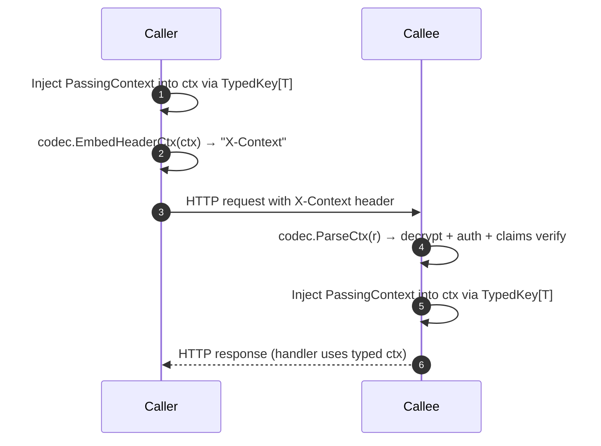

# xctx - Cross Context

Encrypted, signed, **typed** context propagation over a single HTTP header.

`xctx` lets one Go service embed a **predefined struct** (not `map[string]any`) into an HTTP request header (default: `X-Context`), sealed with **AES‑256‑GCM** and accompanied by a **KID** (key id). The callee decrypts, verifies integrity & claims (issuer/audience/time), and injects the same typed struct back into `context.Context` for handlers—all without reflection or schema awareness in the library.

> **Why?** You asked for struct-first ergonomics, minimal surface, integrity protection, optional confidentiality, and a single portable header that both **encrypts** and **authenticates** caller-provided context values.

---

## Features

* **Typed payloads** – your own `struct` shape, not `map[string]any`.
* **Single header** – default `X-Context` carrying an authenticated, encrypted envelope.
* **Cryptography** – AES-256-GCM, base64url; tamper-evident and confidential.
* **Claims** – issuer (`iss`), audience (`aud`), not‑before (`nbf`), issued‑at (`iat`), expiry (`exp`), id (`jti`).
* **Key rotation** – `CurrentKID` + `OtherKeys` (accepted old keys) per service.
* **AAD** – Optional Additional Authenticated Data binder (must match both sides).
* **Zero reflection** – the library does not know your struct; you keep full control.
* **Ergonomic builders** – env→user→defaults→validate; returns a `Codec[T]` and a typed key.

---

## Installation

```bash
# inside your module
go get github.com/ArieDeha/xctx@latest
```

### Import

```go
import xctx "github.com/ArieDeha/xctx"
```

---

## Quick start: Caller & Callee

### Shared typed payload

```go
// example/passing_context.go (conceptual)
type PassingContext struct {
    UserID   int32  `json:"uid"`
    UserName string `json:"un"`
    Role     string `json:"role,omitempty"`
}
```

### Callee (receiver)

A minimal server that **parses** `X-Context`, validates it, and injects `PassingContext` into `r.Context()`.

```go
// example/callee/main.go (excerpt)
user := xctx.Config{
    HeaderName: xctx.DefaultHeaderName,
    Issuer:     "svc-caller",
    Audience:   "svc-callee",
    TTL:        2 * time.Minute,
    CurrentKID: "kid-demo",
    CurrentKey: []byte("0123456789abcdef0123456789abcdef"), // 32B
}
codec, tkey, err := xctx.BuildCodecFromEnvWithKey[PassingContext](user, nil, nil)
if err != nil { log.Fatal(err) }

mux := http.NewServeMux()
mux.Handle("/whoami", http.HandlerFunc(func(w http.ResponseWriter, r *http.Request) {
    // Middleware could call codec.ParseCtx(r) and inject into context.
    ctx, pc, err := codec.ParseCtx(r)
    if err != nil { http.Error(w, err.Error(), http.StatusUnauthorized); return }
    _ = ctx // already contains pc under tkey when using DefaultInjector in server setup
    _ = pc  // parsed typed struct
    // respond
    _ = json.NewEncoder(w).Encode(map[string]any{"ok": true, "user": pc})
}))
```

### Caller (sender)

A minimal client that **seals** `PassingContext` into `X-Context` then calls the callee.

```go
// example/caller/main.go (excerpt)
user := xctx.Config{
    HeaderName: xctx.DefaultHeaderName,
    Issuer:     "svc-caller",
    Audience:   "svc-callee",
    TTL:        2 * time.Minute,
    CurrentKID: "kid-demo",
    CurrentKey: []byte("0123456789abcdef0123456789abcdef"), // 32B
}
codec, tkey, err := xctx.BuildCodecFromEnvWithKey[PassingContext](user, nil, nil)
if err != nil { log.Fatal(err) }

pc := PassingContext{UserID: 42, UserName: "arie", Role: "admin"}
req, _ := http.NewRequest(http.MethodGet, "http://127.0.0.1:8081/whoami", nil)
ctx := xctx.DefaultInjector[PassingContext](tkey)(req.Context(), pc)
_ = codec.SetHeader(req, ctx)
resp, _ := http.DefaultClient.Do(req)
```

> The examples in `example/caller` and `example/callee` are production‑style with full docs—run them directly with `go run`.

---

## Configuration

`xctx` merges config from **env → user overrides → defaults → validate**.

### Environment variables

All optional unless stated. Values from env can be overridden by code.

| Variable              | Meaning                                                      | Example                 |
| --------------------- | ------------------------------------------------------------ | ----------------------- |
| `XCTX_HEADER_NAME`    | Header key                                                   | `X-Context`             |
| `XCTX_ISSUER`         | Issuer string to set/expect                                  | `svc-caller`            |
| `XCTX_AUDIENCE`       | Audience to set/expect                                       | `svc-callee`            |
| `XCTX_TTL`            | Lifetime (Go duration)                                       | `2m`, `30s`             |
| `XCTX_CURRENT_KID`    | **Required** if not provided in code                         | `kid-demo`              |
| `XCTX_CURRENT_KEY`    | 32B key; **hex**, **base64** (std or rawurl), or raw 32‑char | `0123...`               |
| `XCTX_OTHER_KEYS`     | CSV of `kid=key` (accepted old keys)                         | `kid1=<hex>,kid2=<b64>` |
| `XCTX_TYPED_KEY_NAME` | Local-only typed key label                                   | `xctx`                  |

> Keys *must decode to 32 bytes*. `OtherKeys` allows your server to accept tokens minted with previous keys during rotation.

### Programmatic overrides

```go
user := xctx.Config{
    Issuer:     "svc-caller",
    Audience:   "svc-callee",
    TTL:        2 * time.Minute,
    CurrentKID: "kid-demo",
    CurrentKey: []byte("0123456789abcdef0123456789abcdef"),
}
codec, typedKey, err := xctx.BuildCodecFromEnvWithKey[PassingContext](user, nil, nil)
```

### AAD (Additional Authenticated Data)

Bind extra bytes that must match on both sides (not sent in the token). Good for tenant binding, request class, etc.

```go
binder := func() []byte { return []byte("TENANT=blue") }
codec, key, err := xctx.BuildCodecFromEnvWithKey[PassingContext](user, nil, binder)
```

---

## How it works

### Sequence diagram



### On-the-wire envelope (v1)

```
X-Context: v1.<base64url(envelope-json)>

Envelope fields:
  V:   1
  Alg: "AES256-GCM"
  KID: current key id
  N:   nonce (base64url)
  CT:  ciphertext+tag (base64url)
```

> Payload JSON includes claims (`iss`, `aud`, `iat`, `nbf`, `exp`, `jti`) and your typed `ctx` object. The library verifies time windows and claims if configured.

---

## API overview (most-used)

```go
// Typed key creation (local identity, not serialized)
tk := xctx.NewTypedKey[PassingContext]("xctx")

// Builders
codec, tk, err := xctx.BuildCodecFromEnvWithKey[PassingContext](userCfg, nil /* auto key */, nil /* aad */)
codec, err := xctx.BuildCodecFromEnv[PassingContext](userCfg, xctx.DefaultExtractor[PassingContext](tk), xctx.DefaultInjector[PassingContext](tk), nil)

// Caller side: attach header
ctx := xctx.DefaultInjector[PassingContext](tk)(ctx, pc)
name, value, err := codec.EmbedHeaderCtx(ctx) // usually use SetHeader
_ = codec.SetHeader(req, ctx) // sets header name/value directly

// Callee side: parse header & inject typed value
ctx2, pc, err := codec.ParseCtx(req)
```

Additional helpers (selected):

* `NewKeyring(currentKID, currentKey, otherKeys)` – key material holder.
* `WithIssuer/WithAudience/WithTTL/WithHeaderName/WithAADBinder` – codec options.

---

## Key rotation

* **Minting**: callers use `CurrentKID`/`CurrentKey`.
* **Acceptance**: callees set `OtherKeys` to accept previous KIDs while clients are rolling.
* Roll the key, update callee’s `OtherKeys` to include the old key, then later drop it.

---

## Project layout

```
xctx/
├─ go.mod
├─ LICENSE-APACHE-2.0.txt   # Apache 2.0
├─ README.md
├─ example/
│  ├─ caller/
│  │  ├─ go.mod
│  │  └─ main.go
│  └─ callee/
│     ├─ go.mod
│     └─ main.go
├─ xctx.go                  # core library (Codec, TypedKey, etc.)
├─ xctx_config.go           # config, env loader, builders
├─ xctx_whitebox_test.go    # library internals & failure paths
├─ xctx_blackbox_test.go    # public API roundtrips
├─ xctx_config_whitebox_test.go  # config internals & branches
└─ xctx_config_blackbox_test.go  # config public API tests
```

---

## Running the examples

```bash
# Terminal A
cd example/callee && go run .

# Terminal B
cd example/caller && go run .
```

Optional environment for the demo (overrides code defaults):

```bash
export XCTX_CURRENT_KID=kid-demo
export XCTX_CURRENT_KEY=0123456789abcdef0123456789abcdef  # raw 32 chars
export XCTX_ISSUER=svc-caller
export XCTX_AUDIENCE=svc-callee
export XCTX_TTL=2m
```

---

## Testing & coverage

```bash
# All tests with coverage summary
go test ./... -cover

# HTML coverage
go test ./... -coverprofile=cover.out && go tool cover -html=cover.out
```

> The suite includes extensive **white-box** and **black-box** tests for both core and config, designed to maintain ≥90% LOC coverage for `xctx.go` and `xctx_config.go`.

---

## Security considerations

* Use **TLS** end-to-end; the header is encrypted, but transport security prevents passive metadata leaks and header tampering.
* Avoid logging the full `X-Context` header in production logs.
* Keep clocks roughly synchronized; `nbf`/`exp` checks are enforced.
* Keep payloads small to avoid header size limits.
* Treat keys as secrets; prefer a secret store or KMS.

---

## License

Licensed under the **Apache License, Version 2.0**.

* See [LICENSE-APACHE-2.0.txt](LICENSE-APACHE-2.0.txt)
* You may not use this project except in compliance with the License.
* Unless required by law or agreed to in writing, software distributed under the
  License is distributed on an **"AS IS" BASIS**, WITHOUT WARRANTIES OR CONDITIONS
  OF ANY KIND, either express or implied.

---

## FAQ

**Q: Why a struct instead of `map[string]any`?**
A: Strong typing improves compile‑time guarantees and keeps your app code clean. `xctx` never inspects your struct; it just moves bytes.

**Q: Can I use JWT?**
A: This is lighter: one sealed, versioned envelope in a single header with your typed payload—no schema registration or map juggling.

**Q: What if caller and callee disagree on AAD?**
A: Decryption fails (GCM tag mismatch). Keep AAD binders identical when used.

**Q: How big can the payload be?**
A: Keep it small (tens to few hundreds of bytes). HTTP intermediaries might truncate very large headers.
